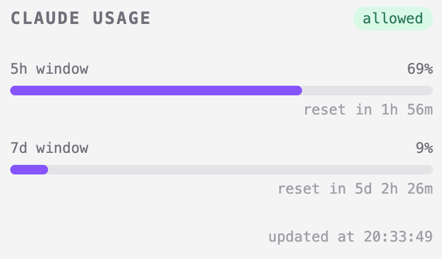
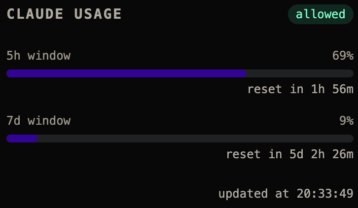

# claude-usage-api

Minimal dashboard showing Claude Pro/Max usage against rate limits. Makes a tiny API call and reads the `anthropic-ratelimit-unified-*` response headers to surface 5h and 7d utilization.

<p align="center">
  
  
</p>

## API

```
GET /api/usage
```

```json
{
  "usagePercent5h": 69,
  "resetIn5h": 6769,
  "usagePercent7d": 9,
  "resetIn7d": 440569,
  "status": "allowed",
  "ok": true,
  "fetchedAt": 1778783831188
}
```

| field            | meaning                     |
| ---------------- | --------------------------- |
| `usagePercent5h`  | 5h utilization %            |
| `resetIn5h`      | seconds until 5h reset      |
| `usagePercent7d`  | 7d utilization %            |
| `resetIn7d`      | seconds until 7d reset      |
| `status`         | `allowed` or `rate_limited` |
| `ok`             | HTTP success                |
| `fetchedAt`      | timestamp of last fetch     |

## Docker

Docker image available at `ghcr.io/zareix/claude-usage-api`.

```bash
# .env
CLAUDE_OAUTH_TOKEN=your_token_here
```

```bash
docker compose up
```

Or run directly:

```bash
docker run -e CLAUDE_OAUTH_TOKEN=your_token -p 3000:3000 ghcr.io/zareix/claude-usage-api
```

Runs on port `3000`. UI at `http://localhost:3000`.

## Dev

```bash
# .env
CLAUDE_OAUTH_TOKEN=your_token_here
```

```bash
bun install
bun run dev
```
